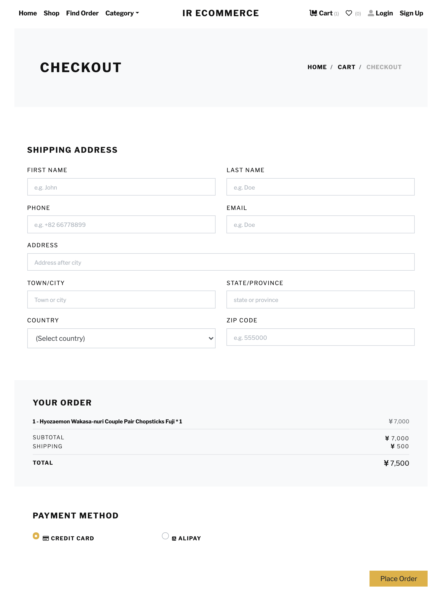
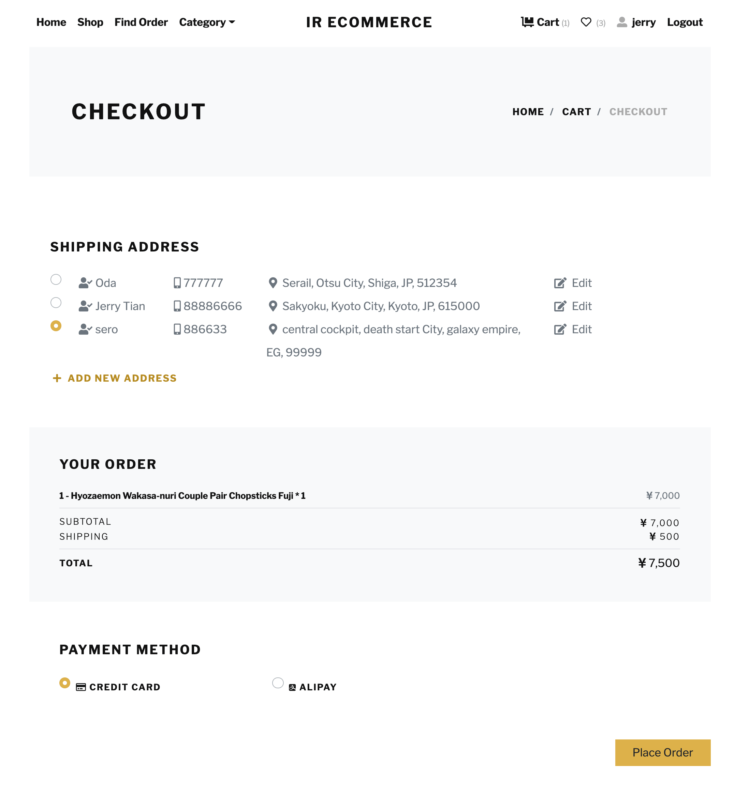

# IR-ecommerce


### About This Project

This is an ecommerce project build mainly by Django Framework + few Javascript/jquery. Using Bootstrap 4 template.

I am a newbie to web development and this is a hands-on project for myself.

If your are tired of writing those helloworld crap, looking for something more challenging to make use of your Django skills, hope this project could be helpful as your reference.

Since I am exploring the right way to impelement those features, I am pretty sure there are many other better approaches. Please feel free to share your ideas and indicate my mistakes, which would be really really appreciated.

### Sample Photos 

- Home - searching, category, trending items


- Shop list - list items, sorting, searching, categorizing


- Item detail - add shopping cart, add wishlist, check reviews, related products


- Shopping cart - item crud operation 


- Checkout - select payment method, edit or add address 



- Guest checkout - add shipping address on checkout



- Find order - guest retrieving order data, making payment/return item 


- Account center - change profile and password, list watch history in watched order


- Account center orders - order status management, pay/refund/return etc, order detail, write review


- Account center - shipping address management


- Account wishlist - list wishlisted items 


- Account activation email - also use for changing account email and sending order status update to customer


- Admin page - appearance, actions


### Features

- account center

  - account registration with email activation (also used in changing email address)
  - login with email address
  - remember login
  - change profile and password (based on ajax request)
  - manage recipient addresses (based on ajax request)
  - order management
  - write review and rate stars for ordered items

- shop

  - list and detail view for items
  - add/remove item to/from wishlist
  - save watch history
  - show related item on detail page
  - fulltext search (postgresql)
  - item list view sorting
  - item tags ([django-taggit](https://github.com/jazzband/django-taggit))
  - recursive category ([django-mptt](https://github.com/django-mptt/django-mptt))

- shopping cart

  - add item to shopping cart
  - CRUD operation on shopping cart page (based on ajax request)
  - guest checkout

- order and payment

  - payment with Stripe Checkout
  - status management ([django-fsm](https://github.com/viewflow/django-fsm))

- customized admin

  - use modern admin theme([django-simpleui](https://github.com/newpanjing/simpleui))
  - custom views and actions (shipping, cancel order, refund)
  - autocomplete search ([easy-select2](https://github.com/asyncee/django-easy-select2))

- others

  - testing with [factory_boy](https://github.com/FactoryBoy/factory_boy) and [faker](https://github.com/joke2k/faker)
  - customized admin theme
  - rich text editor in admin page ([django-ckeditor](https://github.com/django-ckeditor/django-ckeditor))
- use Sentry for monitoring
  
  

### Tech Stack 

- Django (>=3.1)

- PostgresSQL

- Redis

  - web site caching
  - login session cache database
  - message queue broker
  - shopping cart, watch history, wishlist database

- AWS S3

  - media file storage

- AWS SES (prod env only)

- Celery

  - async tasks
  - periodic tasks / cron jobs

- Docker

  

### How To Start

First clone the repository:

```shell
$ git clone https://github.com/convers39/IR-ecommerce.git
```

Setup your local env file, in my example, the project folder tree looks as below, the env file located in core folder. The default location recognized by docker-compose file is the same directory with docker-compose (in this case the root dir), make sure you set the right file path for env file.

```shel
.
├── LICENSE
├── README.md
├── _samples
├── apps
│   ├── __init__.py
│   ├── __pycache__
│   ├── account
│   ├── cart
│   ├── order
│   └── shop
│       ├── __init__.py
│       ├── __pycache__
│       ├── admin.py
│       ├── apps.py
│       ├── context_processors.py
│       ├── managers.py
│       ├── migrations
│       ├── models.py
│       ├── signals.py
│       ├── tasks.py
│       ├── templatetags
│       ├── tests
│       │   ├── __init__.py
│       │   ├── __pycache__
│       │   ├── factory.py
│       │   ├── test_models.py
│       │   ├── test_urls.py
│       │   └── test_views.py
│       ├── urls.py
│       └── views.py
├── core
│   ├── __init__.py
│   ├── __pycache__
│   ├── asgi.py
│   ├── celery.py
│   ├── env
│   │   ├── env
│   ├── settings
│   │   ├── __init__.py
│   │   ├── __pycache__
│   │   ├── base.py
│   │   ├── local.py
│   │   ├── prod.py
│   │   └── testing.py
│   ├── urls.py
│   └── wsgi.py
├── db
│   ├── __init__.py
│   ├── __pycache__
│   └── base_model.py
├── docker-compose.yml
├── dockerfile
├── manage.py
├── media
├── requirements.txt
├── static
│   ├── css
│   ├── icons
│   ├── img
│   ├── js
│   └── vendor
└── templates
    ├── account
    ├── base.html
    ├── cart
    ├── index.html
    ├── order
    └── shop
```

Then you will need to write down credentials of database, mail server, AWS s3 bucket and Stripe API keys in your env file, and in your settings you can obtain those values:

```python
# core/settings/base.py
# ...
# Mail server settings will be different depending on which mail service you use
EMAIL_BACKEND = 'django.core.mail.backends.smtp.EmailBackend'
EMAIL_HOST = os.environ.get('EMAIL_HOST')
EMAIL_PORT = os.environ.get('EMAIL_PORT')
EMAIL_USE_TLS = os.environ.get('EMAIL_USE_TLS')
EMAIL_HOST_USER = os.environ.get('EMAIL_HOST_USER')
EMAIL_FROM = os.environ.get('EMAIL_FROM')
EMAIL_HOST_PASSWORD = os.environ.get('EMAIL_HOST_PASSWORD')

# Use postgresql as database, SQLite is not tested, and fulltext search is not supported
DATABASES = {
    'default': {
        'ENGINE': 'django.db.backends.postgresql',
        'NAME': os.environ.get('DB_NAME'),
        'USER': os.environ.get('DB_USER'),
        'PASSWORD': os.environ.get('DB_PASSWORD'),
        'HOST': os.environ.get('DB_HOST'),
        'PORT': os.environ.get('DB_PORT'),
    }
}

# AWS setting
AWS_ACCESS_KEY_ID = os.environ.get('AWS_ACCESS_KEY_ID')
AWS_SECRET_ACCESS_KEY = os.environ.get('AWS_SECRET_ACCESS_KEY')
AWS_STORAGE_BUCKET_NAME = os.environ.get('AWS_STORAGE_BUCKET_NAME')
AWS_S3_REGION_NAME = os.environ.get('AWS_S3_REGION_NAME')  # change to your region
AWS_S3_SIGNATURE_VERSION = os.environ.get('AWS_S3_SIGNATURE_VERSION')
AWS_S3_FILE_OVERWRITE = True # either true or false is ok

# stripe key
STRIPE_SECRET_KEY = os.environ.get('STRIPE_SECRET_KEY')
STRIPE_PUBLIC_KEY = os.environ.get('STRIPE_PUBLIC_KEY')
WEBHOOK_SECRET = os.environ.get('WEBHOOK_SECRET')
```

Now build the image and compose up the containers, add `--build` flag to compose up when rebuild is needed.

```bash
$ docker build .
$ docker-compose up 
```

Start an empowered interactive shell in django container, use the container name (django in this project)

```bash
$ docker exec -it <django> bash
$ python manage.py shell_plus
```

Access to Postgresl and Redis

```bash
$ docker exec -it <pgdb> psql -U <username> <password>
```

```bash
$ docker exec -it <redis> sh
# redis-cli
```

To run a test, specify a setting file (might run to errors with debug toolbar if not using testing settings, which forces to turn off DEBUG)

```bash
$ python manage.py test <appname> --settings=core.settings.testing
```


### Future Updates

Currently on plan:

- filters on shop item list and account center
- third party Oauth login
- ~~guest shopping cart and checkout~~
- coupon apply on shopping cart page
- deployment a demo site + deployment setup


------

##### Template credits: 

[BOOTSTRAP TEMPLE](https://bootstraptemple.com/p/bootstrap-ecommerce)

